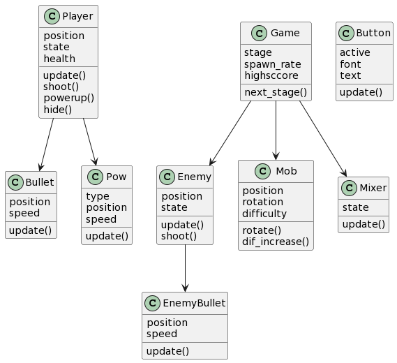

# ТЗ

<big>Необходимо провести рефакторинг кода

- Распределить классы по соответстующим модулям
- Создать модуль support, в котором будут функции для импорта изображений
  (чтобы не повторять их в каждом модуле)

- Избавиться от клобальных функций (menu(), show_shop()) и создать для них
  отдельные классы (или же просто закинуть их в методы game?)
- Добавить документацию к функциям 

<big>Добавить кооператив</big>

- Написать сервер
- Написать сеть
- Связать с клиентом

<big>Диаграмма классов на данный момент </big>

<big>Что ожидается увидеть</big>